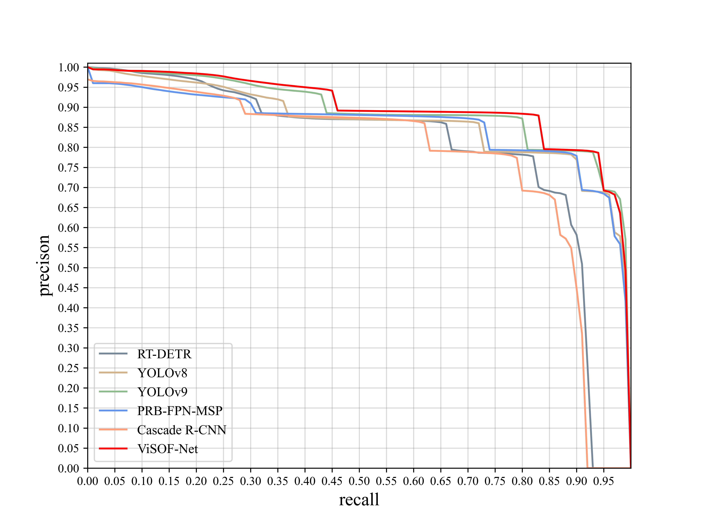
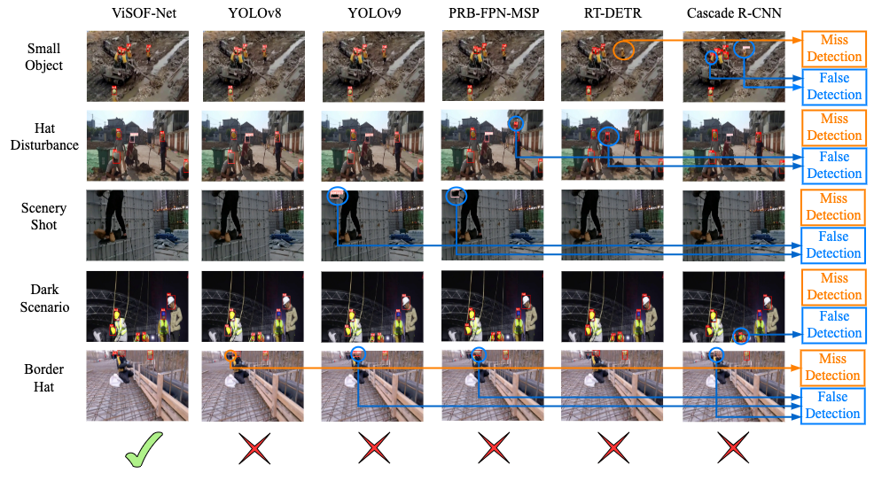

<h2 align="center">Boosting the Video Surveillance Performance via the Fusion of Optical Flow Estimation and Object Detection</h2>
<p align="center">
    <!-- <a href="https://github.com/lyuwenyu/RT-DETR/blob/main/LICENSE">
        
    </a> -->
    <a href="https://github.com/lyuwenyu/RT-DETR/blob/main/LICENSE">
        
    </a>
    <a href="https://github.com/lyuwenyu/RT-DETR/pulls">
        
    </a>
    <a href="https://github.com/lyuwenyu/RT-DETR/issues">
        
    </a>
    <a href="https://github.com/lyuwenyu/RT-DETR">
        
    </a>
    <a href="mailto: yuliu199711@tongji.edu.cn">
        
    </a>
</p>

---

<div align="center">
    <a href="./">
        
    </a>
</div>


This is the official implementation of the paper "[Boosting the Video Surveillance Performance via the Fusion of Optical Flow Estimation and Object Detection](https://arxiv.org/abs/****.*****)".


## 🚀 Updates
- \[2024.06.19\] Add implemention algorithm of TPR-Transformation.
- \[2024.05.16\] Fix some bugs, and add some comments.
- \[2024.05.15\] Release ViSOF-Net.

## 💡 Introduction
We propose a novel ViSOF-Net that exhibits state-of-the-art performance. It introduces recurrent optical flow estimation into object detection for safety monitoring. Our ViSOF-Net achieves 89.5% AP<sup>[.5:.05:.95]</sup>, 85.3% AP<sup>S</sup>, 88.9% AP<sup>M</sup>, 94.7% AP<sup>L</sup> on our proposed large scale dataset PPE725 vid. It outperforms all the detection models including YOLOv9, which was proposed a few months ago.
<div align="center">
  
</div>

## 🦄 Performance
### 🏕️ Comparison with other models
| Model         | Input Size | Parameters(M) | AP(.5:.0.5:.95) | AP(S) | AP(M) | AP(L) |
|---------------|:-----------|---------------|-----------------|:------|:------|:------|
| YOLOv8        | 640        | 44            | 85.9            | 79.9  | 83.6  | 93.1  |
| YOLOv9        | 640        | 69            | <u>88.8 </u>           |<u> 83.1</u>  | <u>87.3</u>  | **94.8**  |
| RT-DETR       | 640        | 42            | 79.4            | 75.2  | 75.2  | 88.6  |
| PRB-FPN-MSP   | 640        | 106           | 85.3            | 81.8  | 84.3  | 89.8  |
| Cascade R-CNN | [800,1333] | 272           | 77.1            | 73    | 75.1  | 83.4  |
| **ViSOF-Net**     | 640        | 41            | **89.5**            | **85.3**  | **88.9**  | <u>94.7</u>  |

**Notes:**
- To get the weights of models in the table：

    Baidu Cloud Link: https://pan.baidu.com/s/1bkvDSY1mwKcBjNXrJLGA9g

    Code: f3a4

### 🌋 Complex Scenarios
<div align="center">
  
</div>

### 🌋 Diversity of Proposed Dataset
<div align="center">
  
</div>

## 📍 Implementations
- 🔥 ViSOF-Net in pytorch: [code](./visof_net), [weights](./visof_net/weight)


### Install
```github
git clone https://github.com/YuLiu-61/ViSOF-Net.git
cd ViSOF-Net/visof_net
pip install -r requirements.txt
```
### Training
- #### Data preparation
    * Download hat dataset images and labels from:

        Baidu Cloud Link: https://pan.baidu.com/s/1jT4Yyhq2f_86V48gmioW0g 

        Code: oe9r

        This dataset includes 12,277 images of 2 classes(hat and person). If training on custom dataset, make sure your dataset structure is YOLO format.

- #### CFG preparation
    * Modify the dataset information in data/coco.yaml.

    * Modify cfg/training/yolov7-temporal.yaml, change nc as your dataset’s number of classes.

- #### Single GPU training 
    Our model only supports one-batch training now, you can start training as follows:
    ```github
    python train.py --cfg cfg/training/yolov7-temporal.yaml --data data/yourDataset.yaml
    ```

### Test
- #### Data preparation
    Download hard hat dataset video frames and labels from :

    Baidu Cloud Link：https://pan.baidu.com/s/19l5ds5_TyEOCdzjBY92ZMQ 

    Code：gr69

    This dataset includes 170,974 video frames of 2 classes(hat and person).

- #### CFG preparation
    1. Modify the val path with your test dataset path in data/coco.yaml.

    2. Modify class Temporal in models/common.py by replacing #temporal part for train with # 17 frames aggregation for detect and test.

- #### Single GPU training 
    You can start testing as follows:
    ```github
    python test.py --weights {weights of your own model} --data data/yourDataset.yaml
    ```

### Inference
- #### On video
    ```github
    python detect.py --weights {weights of your own model} --source {path of video}
    ```
- ##### On image
    ```github
    python detect.py --weights {weights of your own model} --source {path of image}
    ```

## Citation
If you use `ViSOF-Net` in your work, please use the following BibTeX entries:
```
@misc{liu2024visof,
      title={Boosting the Video Surveillance Performance via the Fusion of Optical Flow Estimation and Object Detection},
      author={Yu Liu and Suyu Zhang and Shaolong Shu and Feng Lin},
      year={2024},
      eprint={****.*****},
      archivePrefix={arXiv},
      primaryClass={cs.CV}
}
```
